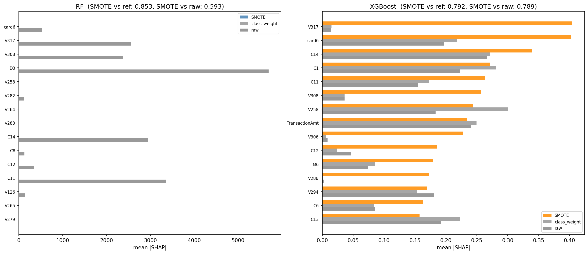
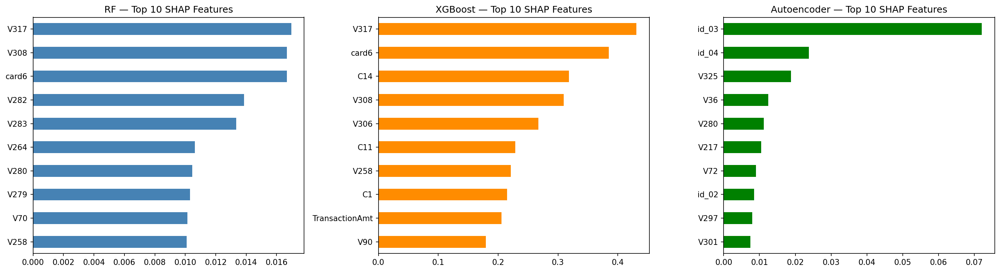
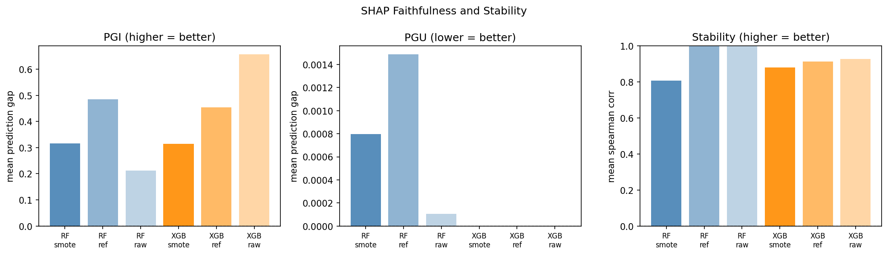

# Fraud Detection with Explainable AI: Measuring SMOTE-Induced SHAP Distortion

**Does SMOTE distort what SHAP thinks is important?**

Most fraud detection pipelines apply SMOTE to handle class imbalance, then use SHAP to explain model decisions, treating the two steps as independent. This project tests whether that assumption holds.

## Research Question

When SMOTE generates synthetic minority-class samples, it shifts the training distribution. Since SHAP explains model behaviour rather than ground truth, any change to what the model learned will show up in SHAP values. The question is: **does SMOTE change which features SHAP identifies as important, and does it affect explanation faithfulness?**

## Key Findings

- **40% of XGBoost's top-10 SHAP features change after SMOTE** compared to a class-weighted baseline
- A SMOTE-promoted feature (V306) **actively suppresses** fraud predictions when masked, the direction is wrong
- XGBoost trained on raw imbalanced data achieves **PGI of 0.657**, nearly double the SMOTE version (0.314)
- SHAP rankings from class-weighted and raw models are nearly identical (Spearman 0.878), while SMOTE diverges from both, confirming the distortion is SMOTE-specific, not a general consequence of imbalance handling

## Models

| Model | PR-AUC | ROC-AUC | F1 |
|---|---|---|---|
| XGBoost | 0.715 | 0.940 | 0.64 |
| Random Forest | 0.679 | 0.924 | 0.59 |
| Autoencoder | 0.235 | 0.776 | 0.30 |

## Dataset

[IEEE-CIS Fraud Detection Dataset](https://www.kaggle.com/c/ieee-fraud-detection) — 590,540 transactions, 434 features, 3.5% fraud rate. Download from Kaggle and place in `data/raw/`.

Cross-dataset generalisation test uses the [ULB Credit Card Fraud Dataset](https://www.kaggle.com/datasets/mlg-ulb/creditcardfraud).

## Project Structure

```
├── notebooks/
│   ├── 01_data_preprocessing.ipynb
│   ├── 02_random_forest.ipynb
│   ├── 03_xgboost.ipynb
│   ├── 04_autoencoder.ipynb
│   ├── 05_xai_baseline.ipynb
│   ├── 06_smote_distortion.ipynb
│   ├── 07_faithfulness_pgi_pgu.ipynb
│   ├── 08_ulb_generalisation.ipynb
│   └── 09_error_analysis.ipynb
├── results/
│   ├── figures/
│   └── metrics/
```

## Visualisations

SHAP feature importance shift between SMOTE and non-SMOTE models:



SHAP comparison across model versions:



Faithfulness metrics (PGI/PGU) across all model versions:



## Stack

Python · XGBoost · Scikit-learn · TensorFlow/Keras · SHAP · OpenXAI · Pandas · Matplotlib · Seaborn

## Reference

NCI MSc Artificial Intelligence — Machine Learning Module (H9MLAI), 2026
